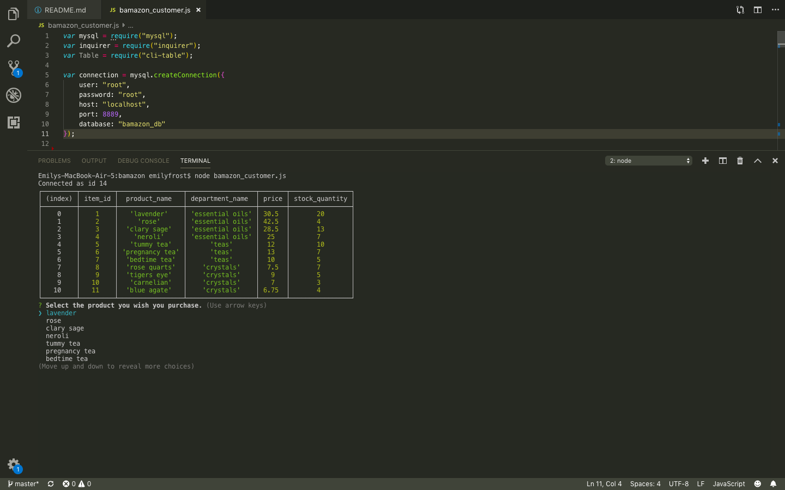
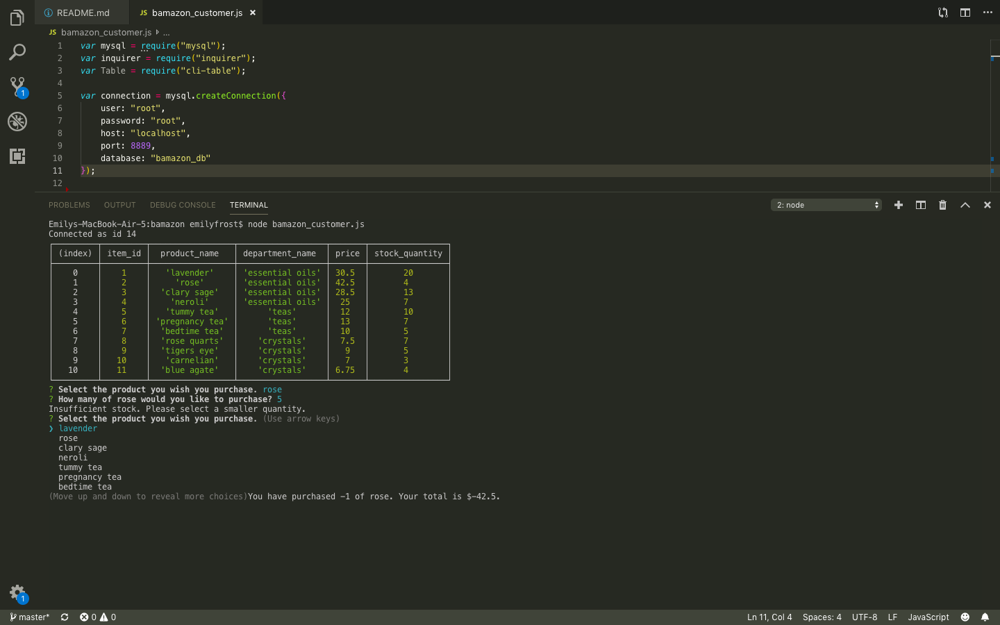
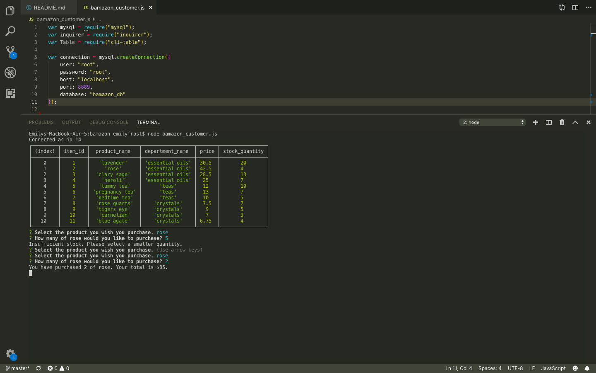
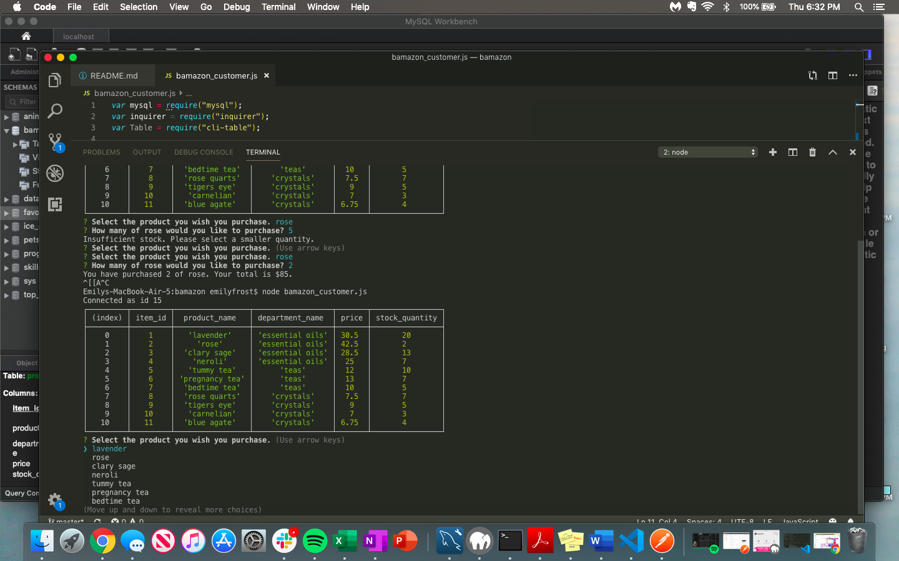

#bamazon: Customer View

Welcome to the Bamazon Store! This project uses node and mySQL to offer a customer interface for purchasing products from the Bamazon Apothecary. 

First the user gets to select which product they wish to purchase .

Next the user is prompted to select how much of that item they wish to purchase. If the user tries to buy more of an item than there is in stock, they'll receive a message indicating their is insufficient stock and be prompted to select a different amount . Once the user has selected how much of a certain item they wish to purhase, if that item has sufficient stock then the user's selection of product as well as amount that the user owes displays . The database is updated accordingly to reflect the change in stock available after the sale . 

